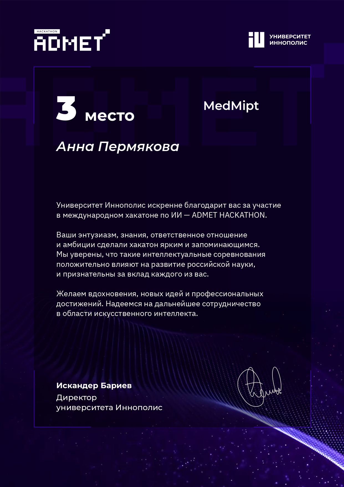

<h2 style="color: #1f618d; font-weight: bold;">Мои проекты</h2>

 
---

<h2 style="color: #1f618d; font-weight: bold; font-size: 28px;">
  <a href="https://github.com/annapermiakova/Stream-it_model_cancer_mammae/" style="color: #1f618d; text-decoration: none;">1. Classification_of_breast_cancer, 2023-2024</a>
</h2>

Это учебный  цифровой стартап является алгоритмом, реализованным в виде веб-приложения, анализирующего маммографические изображения,  автоматически формируя заключение для врача-специалиста

 

*Мои роли в этом проекте*

**Data Collection Lead**  - обработаны данные 430 пациентов,  написан скрипт препроцессинга dicom файлов, собран датасет  из 4960 png-файлов;

**AI Model Methodology Lead** – разработана архитектура модели с использованием трансферного обучения при помощи ResNet50;

**AI Model Development Engineer** – реализована работа модели, развернуто веб-приложение

*Стек* -  PyTorch, OpenCV, NumPy, Pandas, Pillow, OS, Glob,  XML, Google Colab,  VS Codе,  Amazon Web Services, Strеamlit.

 

**Метрики.** Для минимизации  ошибки второго рода (ложноотрицательные результаты), выбрана метрика Recall - 0,94 (Accuracy - 0,92, Precision – 0,95, F1 score – 0,95)

**Валидация модели**

  
 
 Вот демонстрационное видео:

 
---
---

<h2 style="color: #1f618d; font-weight: bold; font-size: 28px;">
  <a href="https://github.com/annapermiakova/Prediction-of-bronchopulmonary-dysplasia/" style="color: #1f618d; text-decoration: none;">2. Prediction-of-bronchopulmonary-dysplasia 2022-2024</a>
</h2>

  
  
Эта цифровая прогностическая модель бронхолегочной дисплазии у новорожденных - авторский волонтерский проект, осуществляемый совместно с Перинатальным Центром г. Перми

Для построения модели использовала следующие алгоритмы :  SVC,  Random Forest Classifier, Gradient Boosting Classifier, логистическая регрессия

**Результат** 

Он-лайн калькулятор   на Streamlit

**Статья** "Раннее прогнозирование бронхолегочной дисплазии у глубоко недоношенных детей: когортное исследование"  
- [Посмотреть статью](https://doi.org/10.17816/pmj413120-128)

---
---

<h2 style="color: #1f618d; font-weight: bold; font-size: 28px;">
  <a href="https://github.com/annapermiakova/AutID/" style="color: #1f618d; text-decoration: none;">3. AutID 2024-2025</a>
</h2>

Проект скрининговой диагностики расстройств аутистического спектра   у детей раннего возраста с использованием видеоизображений - волонтерский групповой  проект  совместно с Институтом коррекционной педагогики (г. Москва). 

*Моя роль в проекте* - разведочный анализ данных  видеоизображений,  аннотация кадров, обработка и сегментация видео (стандартизация, нормализация), извлечение результатов позы из RGB-изображений(OpenCV, Pillow, MediaPipe Pose).

---
---

<h2 style="color: #1f618d; font-weight: bold; font-size: 28px;">
  4. Discriminant Analysis of Main Prognostic Factors Associated with Hemodynamically Significant PDA, 2020-2022
</h2>

Авторский цифровой продукт – программа для экспресс-диагностики гемодинамически значимого функционирующего артериального протока у недоношенных новорожденных.

  
  

Полученная модель прогнозирования успешно классифицировала 85,9% пациентов с AUC 0,89. Используемые в модели факторы имели наилучшее сочетание чувствительности и специфичности: sensitivity 84,8 % и specificity 86.8%.

**Результаты** работы представлены в журнале **Journal of Clinical Medicine** (CiteScore - Q1):
- [Просмотреть статью в журнале Journal of Clinical Medicine](https://www.mdpi.com/2077-0383/10/16/3729)

*Публикация в прессе*:
- [Разработка российских ученых поможет улучшить тактику лечения глубоко недоношенных детей](https://scientificrussia.ru/articles/razrabotka-rossijskih-ucenyh-pomozet-ulucsit-taktiku-lecenia-glubokonedonosennyh-detej)

*Патент и свидетельство на программный продукт*

  
  

---
<h2 style="color: #1f618d; font-weight: bold;">Хакатоны 2024</h2>
<a href="https://github.com/annapermiakova/AutID/" style="color: #1f618d; text-decoration: none;">3. AutID 2024-2025</a>

</h2>

**Хакатон  Медси/SF** (февраль).  **1 место** в командном зачете, учебный хакатон «Автоматическое чтение гарантийных писем». Моя роль - сбор и предварительная подготовка данных (Python, pandas, NumPy, matplotlib, seaborn, OpenCV, Pillow),  Feature Engineering.

**ADMET HACKATON** (Иннополис, г.Казань, сентябрь), **3 место** в индивидуальном зачете. Моя роль – дата сайентист в разработке точных моделей классификации, способных предсказывать бинарные метки на основе химических структур соединений, представленных в формате SMILES.

**Сеченовский хакатон по биоинформатике и клинической онкологии** (г.Москва, октябрь) **1 место** в командном зачете, моя роль - анализ данных (EDA) новой базы опухолевых транскриптомов

**Сеченовский хакатон по цифровой патологи и искусственному интеллекту** (г.Москва, ноябрь) **1 место в индивидуальном зачете**. Задача - обучение нейросети для анализа данных изображений опухолевых тканей      Мое решение использует модель на основе EfficientNetB0 для классификации изображений тканей на опухолевые и нормальные.Итоговая модель достигает высокой точности и F1 Score=0,98 на тестовой выборке. 
- [Посмотреть репозиторий](https://github.com/annapermiakova/tissue_classification)

---
<h2 style="color: #1f618d; font-weight: bold;">Сертификаты, дипломы, патенты</h2>

  
  
  
  
   
  

---

---

Page template forked from <a href="https://github.com/evanca/quick-portfolio">evanca</a>

<!-- Remove above link if you don't want to attibute -->
